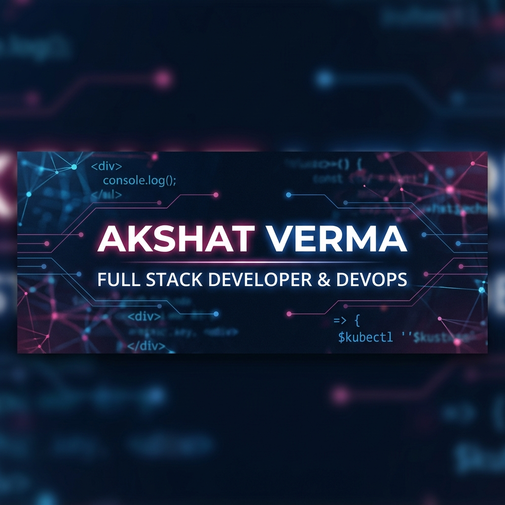

<!-- Visitor Badge -->

  

<!-- Header Banner -->

  

<!-- Typing Intro -->
<h1 align="center">
  
</h1>

<h3 align="center">A passionate software developer and DevOps enthusiast from India 🇮🇳</h3>

  
  

 

## 💫 Bio

  🔭 &nbsp;<b>Currently</b> &mdash; Designing high-performance full-stack web architectures, optimizing database schemas, and streamlining cloud deployments using DevOps automation.  
  🌱 &nbsp;<b>Active Focus</b> &mdash; Building production-ready applications with <b>React</b> & <b>Node.js</b> while mastering scalable <b>AWS</b> cloud setups.  
  💬 &nbsp;<b>Tech Discussions</b> &mdash; Always excited to chat about web scalability, backend performance in <b>Java</b>, or anything JavaScript. Start a discussion or open an issue <a href="https://github.com/AKSHATVERMA628/AKSHATVERMA628/issues"><b>here</b></a>!  
  ⚡ &nbsp;<b>Fun Fact</b> &mdash; When I'm not writing code or debugging, you can find me analyzing movie plots, binge-watching thriller series, or immersed in gaming.

---

## 🛠️ Tech Stack & Tools

  <b>💻 Frontend</b> 
  &nbsp;&nbsp;
  &nbsp;&nbsp;
  &nbsp;&nbsp;
  &nbsp;&nbsp;
  

 

  <b>⚙️ Backend & Database</b> 
  &nbsp;&nbsp;
  &nbsp;&nbsp;
  &nbsp;&nbsp;
  &nbsp;&nbsp;
  &nbsp;&nbsp;
  

 

  <b>🔧 DevOps & Tools</b> 
  &nbsp;&nbsp;
  &nbsp;&nbsp;
  &nbsp;&nbsp;
  

---

## ✍️ Dev Quote of the Day
<!-- START_QUOTE -->
<blockquote>
  

    <i>"Controlling complexity is the essence of computer programming."</i>  
    &mdash; <b>Brian Kernighan</b>
  

</blockquote>
<!-- END_QUOTE -->
